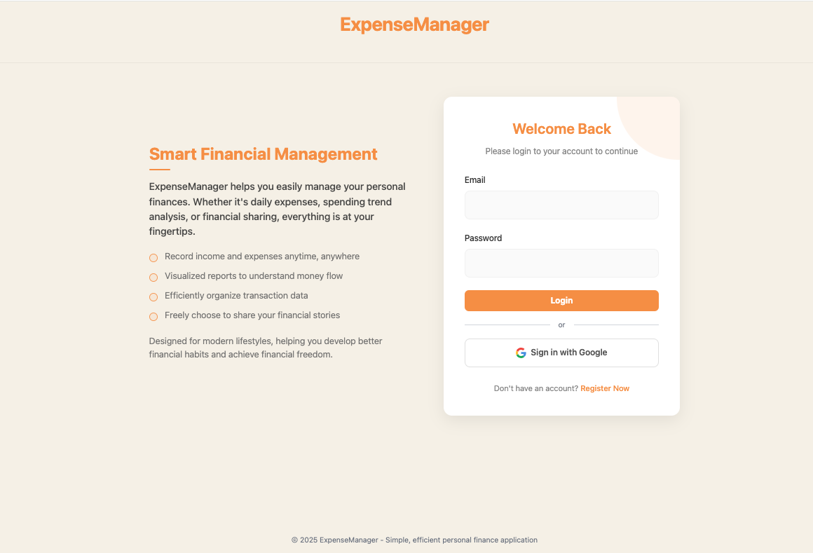
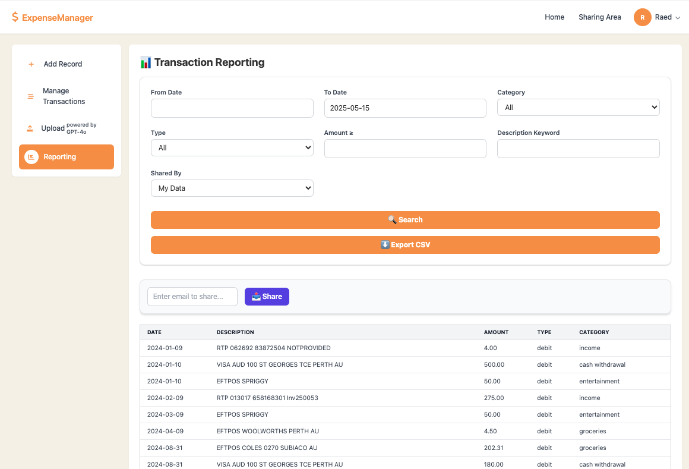

# 💸 ExpenseManager

A modern personal finance management system built with Flask. Supports secure user registration and login, transaction tracking, report generation, file uploads, and sharing with others.


[](https://github.com/Jeffrey86Wan/CITS5505_Group48/blob/main/LICENSE)


---

## 👥 Group Members

| Name               | Student ID |
| ------------------ | ---------- |
| Su-Yeon Yang       | 24650461   |
| Jeffrey Wan        | 23936657   |
| Raed Rahmanseresht | 21016839   |
| Zhongyi Shi        | 24254652   |

---

## ✨ Features

- 🔐 User Authentication (Login/Register)
- 📁 Upload PDF bank statements
- 🤖 GPT-based expense categorization
- 📊 Visual and downloadable reports
- 📤 Share reports with other users

---

## 📁 Project Structure

```
ExpenseManager/
├── app.py                      # Main Flask application entry point, configures the app and starts the server
├── db.py                       # Database configuration and connection management
├── seed.py                     # Initialization/test data script for populating the database
├── requirements.txt            # Python dependencies list
├── alembic.ini                 # Alembic configuration (database migration tool)
├── .gitignore                  # Git ignore file configuration
├── expensemanager.db           # SQLite database file
├── README.md                   # Project documentation
│
├── models/                     # Data models directory
│   ├── __init__.py             # Models initialization file
│   ├── user.py                 # User data model
│   ├── transaction.py          # Transaction data model
│   ├── upload.py               # File upload model
│   ├── shared_report.py        # Shared report model
│   ├── shared_view.py          # Shared view model
│   └── blog.py                 # Blog-related model
│
├── routes/                     # Route modules directory
│   ├── __init__.py             # Routes initialization file
│   ├── home.py                 # Homepage route
│   ├── index.py                # Index page route
│   ├── record.py               # Record management route
│   ├── report.py               # Report generation and display route
│   ├── upload.py               # File upload processing route
│   ├── api.py                  # API interface route
│   ├── flow.py                 # Cash flow route
│   └── auth/                   # Authentication-related routes directory
│       ├── __init__.py         # Auth routes initialization file
│       ├── login.py            # Login authentication route
│       └── oauth.py            # OAuth authentication route
│
├── services/                   # Services layer directory
│   ├── chatgpt_service.py      # ChatGPT integration service
│   └── pdf_service.py          # PDF processing service
│
├── helpers/                    # Helper utilities directory
│   ├── parse.py                # Data parsing tools
│   └── prompt.py               # Prompt generation tools
│
├── templates/                  # Frontend templates directory
│   ├── components/             # Base component templates
│   ├── errors/                 # Error page templates
│   ├── auth/                   # Login and registration templates
│   ├── main/                   # Main feature page templates
│   └── partials/               # Partial view templates
│
├── static/                     # Static resources directory
│   ├── css/                    # Stylesheet files
│   ├── js/                     # JavaScript files
│   └── img/                    # Image resources
│
├── migrations/                 # Database migration scripts directory
├── uploads/                    # User uploaded files storage directory
├── extracted_texts/            # Directory for texts extracted from uploaded files
└── gpt_outputs/                # Directory for ChatGPT generated content outputs
```

## Main File Function Description

1. **Core Files**

   - `app.py` - Application main entry, configures Flask application and starts the Web server
   - `db.py` - Database connection and session management, initializes SQLAlchemy
   - `seed.py` - Generates test data for development and demonstration environments

2. **Data Models**

   - `models/user.py` - User account model, contains authentication and personal information
   - `models/transaction.py` - Transaction record model, stores user income and expense data
   - `models/upload.py` - File upload model, manages records of user uploaded files
   - `models/shared_report.py` - Shared report model, allows users to share reports with others

3. **Route Controllers**

   - `routes/home.py` - Homepage and dashboard views
   - `routes/record.py` - CRUD operations for transaction records
   - `routes/report.py` - Financial report generation and data analysis
   - `routes/upload.py` - Processes user file uploads and data imports
   - `routes/auth/login.py` - User authentication and session management
   - `routes/api.py` - Provides RESTful API interfaces

4. **Services Layer**

   - `services/chatgpt_service.py` - Integrates ChatGPT for intelligent analysis and suggestions
   - `services/pdf_service.py` - PDF file processing and data extraction services

5. **Helper Utilities**
   - `helpers/parse.py` - Data parsing tools, processes different input formats
   - `helpers/prompt.py` - ChatGPT prompt templates and generation tools

✅ Cross-Browser Compatibility Test Results

| Browser        | Version Tested | OS        | Result    | Notes                |
| -------------- | -------------- | --------- | --------- | -------------------- |
| Chrome         | 123+           | macOS/Win | ✅ Passed | All features work    |
| Firefox        | 115+           | macOS/Win | ✅ Passed | Minor CSS difference |
| Safari         | 16+            | macOS     | ✅ Passed | Works fine           |
| Microsoft Edge | 120+           | Windows   | ✅ Passed | No issue             |
| Opera          | 100+           | Windows   | ✅ Passed |                      |

---

## ⚙️ Environment Setup

### 1. Clone the Repository

```bash
git clone https://github.com/your-username/ExpenseManager.git
cd ExpenseManager
```

### 2. Create Virtual Environment and Install Dependencies

```bash
python -m venv venv
source venv/bin/activate  # For macOS/Linux
venv\Scripts\activate   # For Windows

pip install -r requirements.txt
```

### 3. Initialize the Database

```bash
# Method 1: Auto-create on first Flask run
python app.py

# Method 2: Use Flask CLI
flask init-db

# Method 3: Alembic migrations
alembic upgrade head
```

### 4. Seed Test Data

```bash
python seed.py
```

---

## ▶️ Run the App

```bash
python app.py
# or
flask run
```

---

## 🌐 Default URL

```
http://127.0.0.1:5000/
```

---

## 📸 Screenshots

> 

---

## 🔁 Reset the Database

To reset:

```bash
flask delete-db
python app.py
```
---

## 🔐 Environment & Google OAuth Setup

To run this application locally with full functionality (including login and OpenAI features), you'll need to create two configuration files: `.env` and `client_secrets.json`.

To do that:

In the **project root**, duplicate the provided example files:

```bash
cp .env.example .env
cp client_secrets.example.json client_secrets.json

<details>
<summary>🔐 <strong>Environment & OAuth Setup Guide (.env & Google Credentials)</strong></summary>

<br>

To enable OpenAI GPT-based categorization and Google login, follow these configuration steps:

---

### 📌 Step 1: Get Your OpenAI API Key

1. Visit: [OpenAI API Keys](https://platform.openai.com/account/api-keys)
2. Log in and click **"Create new secret key"**
3. Copy the key that looks like `sk-xxxxxxxxxxxxxxxxxxxx`
4. Save it somewhere safe — you won’t see it again!

---

### 📌 Step 2: Create Google OAuth Credentials

1. Go to the [Google Cloud Console](https://console.cloud.google.com/)
2. Create a new project (or use an existing one)
3. Navigate to **APIs & Services → Credentials**
4. Click **"Create Credentials" → "OAuth client ID"**
5. Choose **Web application**
6. Add the following:
   - **Authorized redirect URI:**  
     `http://127.0.0.1:5000/oauth2callback`
   - **Authorized JavaScript origin:**  
     `http://127.0.0.1:5000`
7. Click **Create**
8. Download the config file and rename it to:

```bash
client_secrets.json


---

## 📚 References

- [Authentication Design Document (Google Doc)](https://docs.google.com/document/d/your-doc-id/edit)
- Grinberg, M. — [Flask Mega-Tutorial](https://blog.miguelgrinberg.com/post/the-flask-mega-tutorial-part-i-hello-world)
- [Flask Mega-Tutorial](https://blog.miguelgrinberg.com/post/the-flask-mega-tutorial-part-i-hello-world)
- [Flask Documentation](https://flask.palletsprojects.com/)
- [W3Schools CSS](https://www.w3schools.com/css/)
- [GitHub Docs](https://docs.github.com/)
- Lecture notes and textbook.
- [OpenAI ChatGPT (GPT-4o, GPT-3.5/4, ChatGPT)](https://chat.openai.com/) — Used for code explanation, test design, and debugging assistance.
- [Anthropic Claude (Claude 3.5 Sonnet)](https://www.anthropic.com/index/claude) — Referenced for implementation reasoning and feedback drafting.
- [Google Gemini (Gemini 1.5 / 2.5 Pro)](https://deepmind.google/technologies/gemini/) — Used for architectural suggestions and code review support.

---

_Last updated: 2025-05-16_
